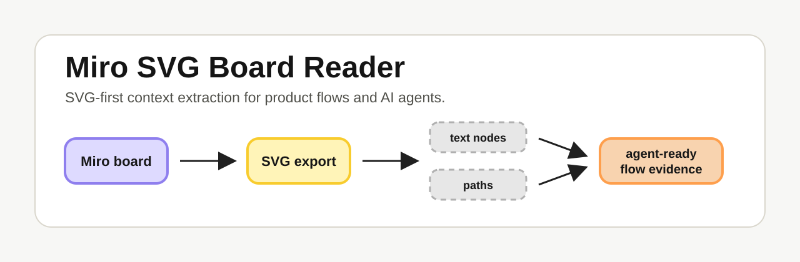

<p align="center">
  
</p>

# Miro Board Dossier

Turn messy Miro boards into clear, reusable context for AI agents.

Use this when your product flow, architecture map, journey, backlog, or decision tree lives in Miro and you need Codex, Claude Code, ChatGPT, Claude, or another agent to understand it before doing real work.

Instead of asking an agent to guess from a screenshot, Miro Board Dossier helps it build a structured brief: what the board shows, how the flow is organized, which labels and arrows were found, what looks decided, and what still needs human confirmation.

## Who This Is For

- Product and ops people who keep important flows in Miro.
- Founders and PMs handing product context to coding agents.
- Engineers who need an agent to understand a board before planning or implementing.
- Teams that want a reusable board summary instead of repeating the same explanation in every chat.

## What You Get

The skill creates a **Board Dossier**: a folder of plain-language notes and structured evidence your agent can reuse.

```text
.miro/svg-specs/<board-name>/
  board-dossier.md
  agent-handoff.md
  visual-map.md
  narrative.md
  domain-model.md
  decisions-and-ambiguities.md
  raw-nodes.json
  raw-edges.json
  flow.mmd
  index.json
```

In practice, this gives your agent:

- a readable summary of what the board represents
- a map of the visual layout and reading order
- the main flow and branches inferred from arrows
- status-like, actor-like, action-like, and decision-like labels
- repeated labels and ambiguous areas called out explicitly
- a handoff file another agent can read before starting work

## Recommended Workflow

1. Open your Miro board.
2. Export the relevant area as **SVG**.
3. Optional but useful: export the same area as PNG or JPG for visual checking.
4. Ask your agent to use `miro-board-dossier`.
5. Give the agent the SVG file and ask it to generate the dossier.
6. Use the dossier as the source of truth for planning, implementation, reviews, or product decisions.

SVG is preferred because it can preserve real text and arrow paths. Screenshots are useful for visual checking, but they are not enough for maximum agent context.

## Install

For Codex:

```bash
npx skills add pmilanez/miro-board-dossier --skill miro-board-dossier -g -a codex --copy -y
```

To see what the package contains:

```bash
npx skills add pmilanez/miro-board-dossier --list
```

To update later:

```bash
npx skills update miro-board-dossier -g
```

Start a new agent session after installing so the skill list can reload.

## How To Ask Your Agent

After installing the skill, a good prompt is:

```text
Use the miro-board-dossier skill.

I exported this Miro board as SVG. Generate a Board Dossier first, then tell me what the board represents, the main flow, the key decisions, the statuses/entities involved, and what is ambiguous.
```

For a bigger handoff:

```text
Use the miro-board-dossier skill and treat the generated dossier as context for the next task. Separate observed board labels from your interpretation. Do not implement anything until you explain what the board says and what remains unclear.
```

## Advanced CLI Usage

Clone the repo:

```bash
git clone https://github.com/pmilanez/miro-board-dossier.git
cd miro-board-dossier
```

Generate a full dossier:

```bash
python3 skills/miro-board-dossier/scripts/extract_miro_svg.py "path/to/board.svg" --dossier-dir .miro/svg-specs
```

Print a quick markdown extraction:

```bash
python3 skills/miro-board-dossier/scripts/extract_miro_svg.py "path/to/board.svg" --format markdown
```

Print JSON evidence:

```bash
python3 skills/miro-board-dossier/scripts/extract_miro_svg.py "path/to/board.svg" --format json
```

Run tests:

```bash
python3 -m unittest discover -s tests
```

No third-party Python packages are required.

## What The Files Mean

- `board-dossier.md`: the main human-readable board brief
- `agent-handoff.md`: the short context another agent should read first
- `visual-map.md`: coordinates, layout, and reading order
- `narrative.md`: flow scaffold from labels and inferred arrows
- `domain-model.md`: detected statuses, actors, systems, actions, decisions, repeated labels, and common terms
- `decisions-and-ambiguities.md`: what the agent should not over-assume
- `raw-nodes.json`: extracted text and positions
- `raw-edges.json`: connector candidates and inferred edges
- `flow.mmd`: Mermaid flowchart for quick visualization
- `index.json`: source, stats, confidence signals, and generated file list

## What It Does Not Pretend

Miro exports are visual artifacts, not perfect process schemas. The dossier helps an agent understand much more, but it still marks uncertainty.

- Curved or complex arrows may need visual confirmation.
- Arrow direction is inferred unless checked visually.
- Repeated labels need position and lane context.
- Text inside raster images may stay hidden.
- Frame titles, comments, and some metadata may need Miro MCP or manual confirmation.

That is intentional. The goal is not fake certainty. The goal is a careful, reusable brief that makes the next agent safer and faster.

## License

MIT
